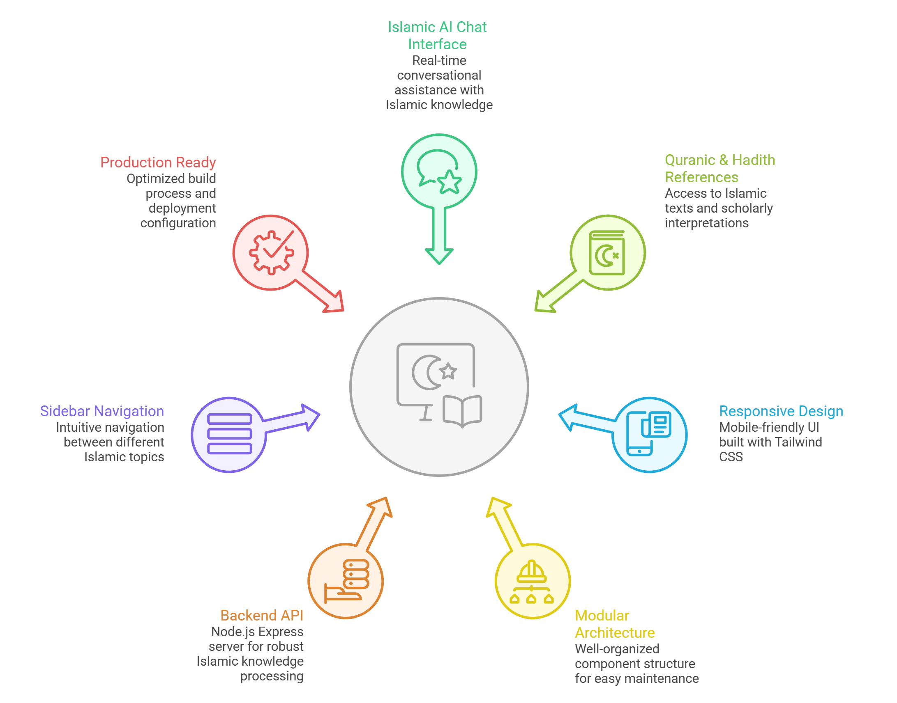
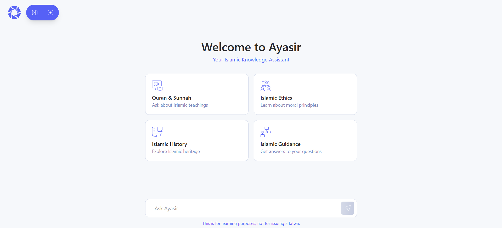
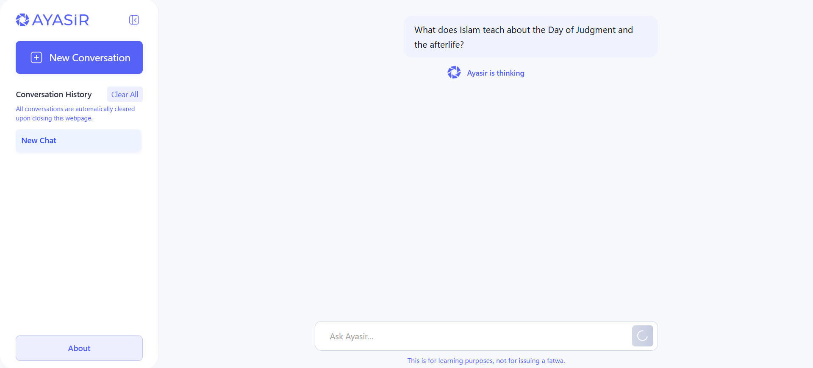
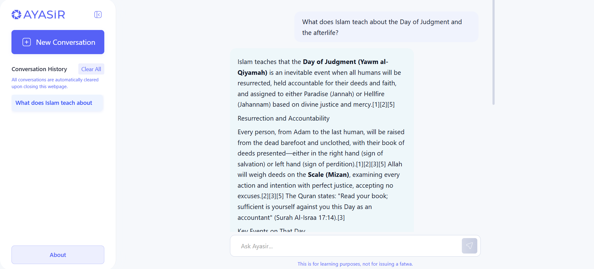
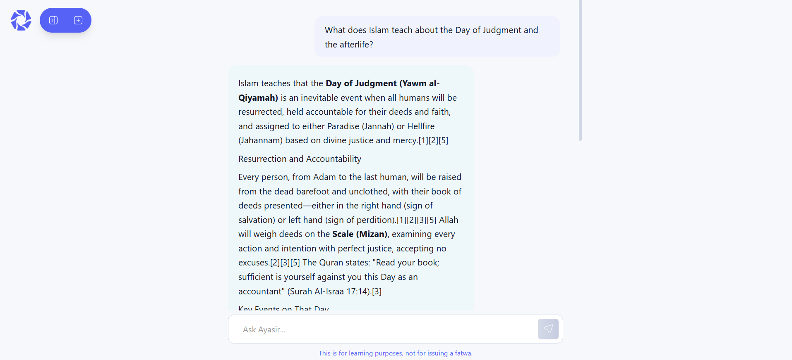
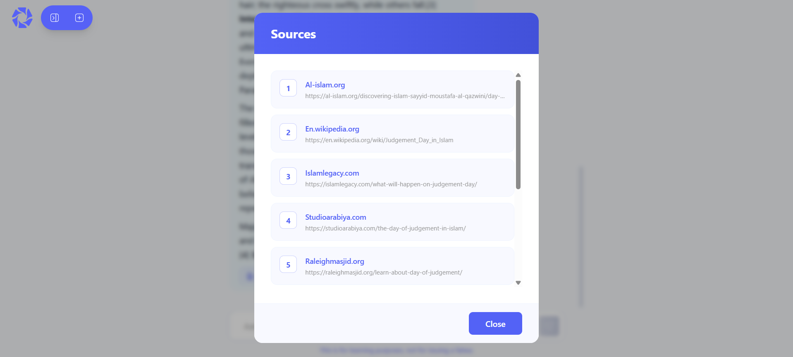

# Ayasir AI Website

## Overview

Ayasir AI Website is a comprehensive full-stack web application designed to provide AI-powered Islamic conversational interactions and assistance through a modern, responsive user interface. The application features a React.js frontend with Tailwind CSS styling, paired with a Node.js backend server for seamless API communication and intelligent Islamic knowledge processing. This platform serves as an intelligent assistant for Islamic queries, Quranic references, Hadith insights, and Islamic guidance.

### Key Features

## System Architecture

## UI Preview

### Application Screenshots

## Conclusion

Ayasir AI Website represents a robust and comprehensive solution for delivering AI-powered Islamic knowledge and assistance. By leveraging modern web technologies and a well-architected full-stack approach, this application provides users with an accessible, reliable, and user-friendly platform for Islamic queries and guidance.The project is designed with scalability, maintainability, and extensibility in mind, making it suitable for both individual users and organizations seeking to integrate Islamic AI capabilities into their digital presence. Whether for personal Islamic learning, community support, or enterprise-level applications, Ayasir AI Website serves as a foundational platform that can be adapted and extended according to specific requirements and use cases.

For questions, contributions, or further development inquiries, please refer to the contributing guidelines and support sections above.